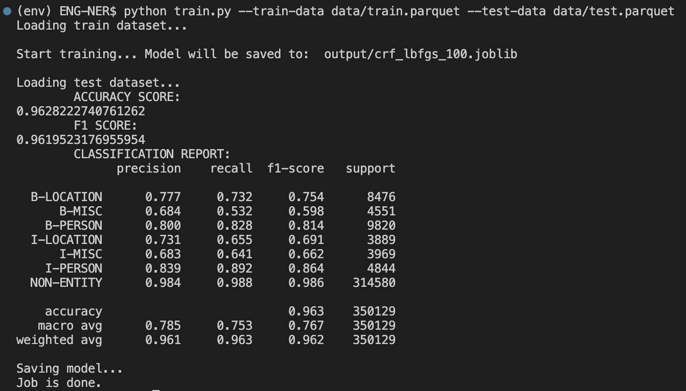
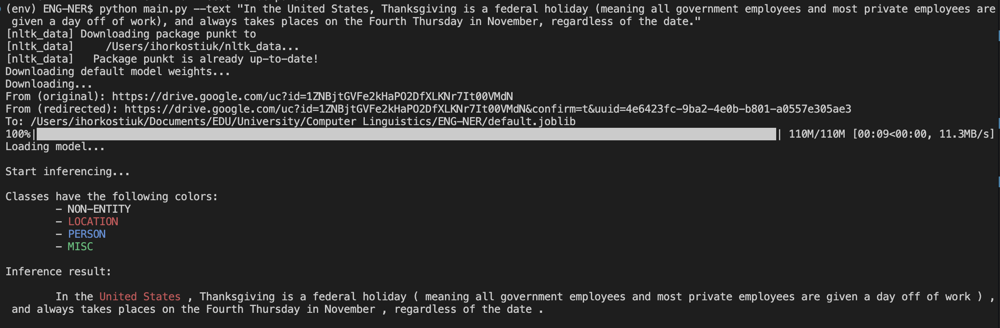

# ENG-NER
Repository for NER task in Deep Learning.

## Installation
Clone the repository:
```
git clone https://github.com/stupidcucumber/ENG-NER.git
```

Install all required packages:
```
python -m pip install -r requirements.txt
```

## Training
In a nutshell, trainining script has the following interface:
```
  -h, --help            show this help message and exit
  --algorithm ALGORITHM
                        Name of one of the algorithms defined in SKlearn CRFSuite.
  --max-iterations MAX_ITERATIONS
                        Maximum times CRF will iterate over a train dataset.
  --train-data TRAIN_DATA
                        Path to the train dataset.
  --test-data TEST_DATA
                        Path to the test dataset.
  --saving-path SAVING_PATH
                        Folder where to put any train info.
```

To train your own model just run
```
python train.py --train-data data/train.parquet --test-data data/test.parquet
```

Example of running a training cycle:


## Inferencing
Inference script has the following interface:
```
  -h, --help         show this help message and exit
  --weights WEIGHTS  If not provided will download weights from the GDrive.
  --text TEXT        Text that needs to be parsed.
```

An example of inference is:
```
python main.py --text "In the United States, Thanksgiving is a federal holiday (meaning all government employees and most private employees are given a day off of work), and always takes places on the Fourth Thursday in November, regardless of the date."
```

Which will produce the following results:

